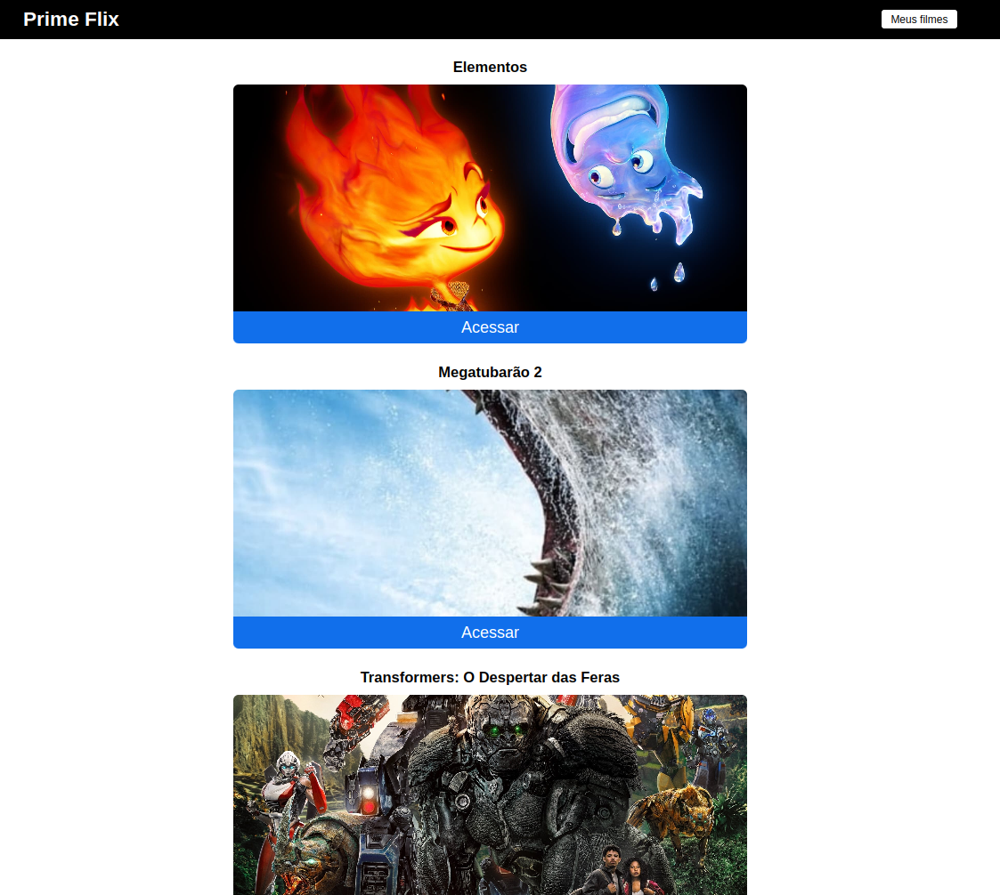
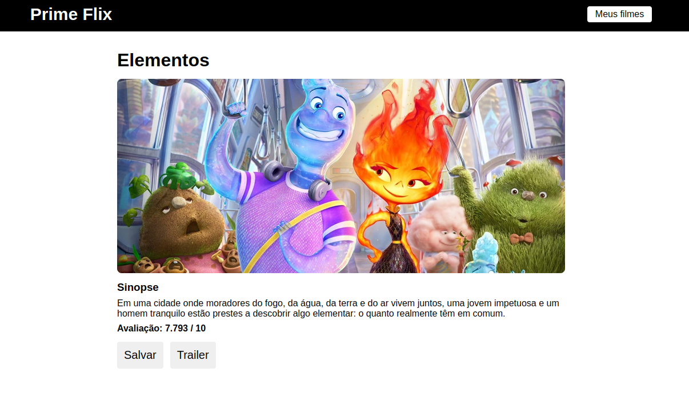
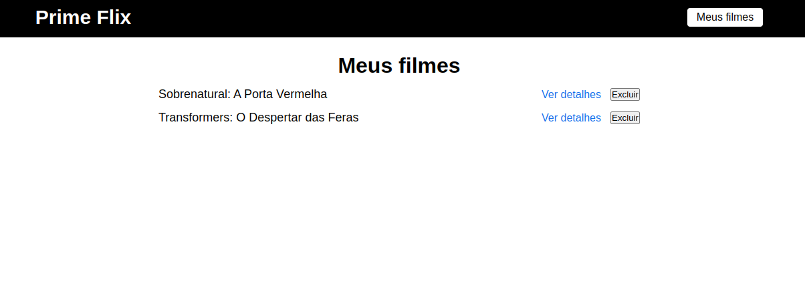

# Prime Flix

This project shows the movies in posters based on <a href='https://developer.themoviedb.org/docs'>TMDB</a> api.

## Available Scripts

In the project directory, you can run:

### `npm start`

Runs the app in the development mode.\
Open [http://localhost:3000](http://localhost:3000) to view it in your browser.

The page will reload when you make changes.\
You may also see any lint errors in the console.

## Tecnologies

This project was made in html, css and js with React Framework.

## Demonstration

 
    
    
    

